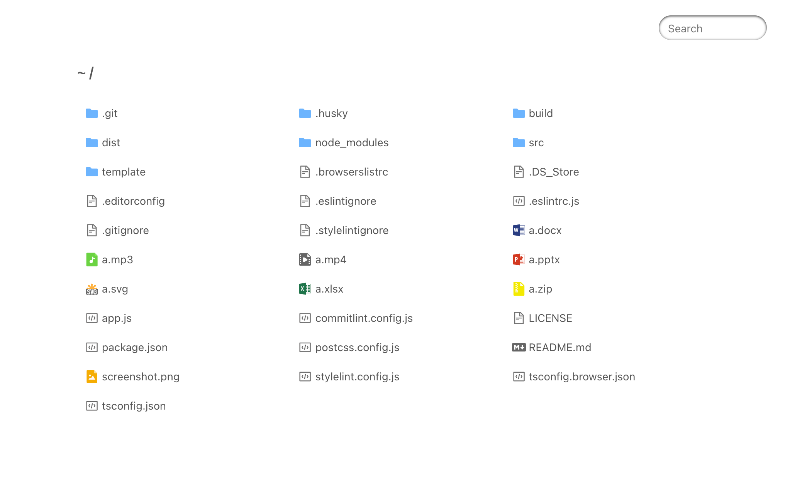

# koa-index

[](http://commitizen.github.io/cz-cli/)

Serve directory listings for Koa

## Install

[](https://nodei.co/npm/koa-index/)

## Screenshot



## Usage

```ts
import Koa from 'koa'
import path from 'path'
import koaStatic from 'koa-static'
import koaIndex from 'koa-index'

const app = new Koa()

// require koa-static send file
app.use(
  koaStatic(__dirname, {
    hidden: true
  })
)

app.use(
  koaIndex(__dirname, {
    hidden: true
  })
)

app.listen(8080)
```

## API

```ts
interface IOpts {
  hidden?: boolean
}

koaIndex(root:string, opts:IOpts)
```

### Options

- **hidden**: Display hidden (dot) files. Defaults to `false`.

## License

MIT
